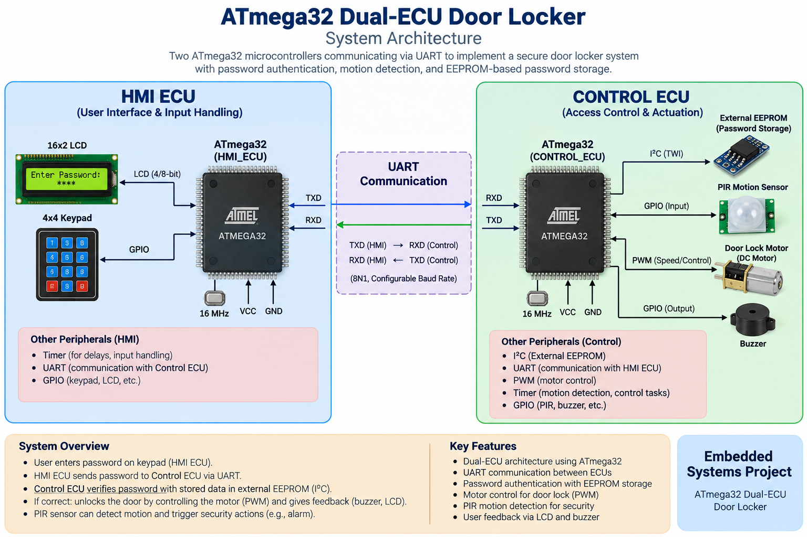

# ATmega32 Dual-ECU Door Locker

A password-based door locker security system implemented using two ATmega32 microcontrollers. The system uses a dedicated HMI ECU for user interaction and a Control ECU for security logic and hardware control, with UART communication between both ECUs.

## System Architecture

## Features

- Dual-ECU architecture using two ATmega32 microcontrollers
- 5-digit password authentication
- Password masking using `*`
- External EEPROM password storage
- Password change functionality
- UART communication between HMI ECU and Control ECU
- Motorized door locking and unlocking
- PIR-based motion detection
- Automatic door locking after no motion is detected
- Buzzer alarm after 3 consecutive incorrect password attempts
- One-minute system lockout after repeated failed attempts
- LCD and 4x4 keypad user interface
- Modular MCAL and HAL driver architecture

## ECU Architecture

### HMI ECU

Responsible for user interaction and communication with the Control ECU.

- LCD
- 4x4 Keypad
- UART
- Password entry and masking
- Main menu and user messages

### Control ECU

Responsible for password verification, security handling, and door control.

- External EEPROM
- PIR Motion Sensor
- DC Motor
- H-Bridge
- Buzzer
- UART
- PWM

## System Operation

### Password Creation

1. User enters a 5-digit password through the keypad.
2. Password digits are displayed as `*` on the LCD.
3. The password is confirmed.
4. HMI ECU sends the password to the Control ECU through UART.
5. Control ECU stores the password in the external EEPROM.

### Open Door

1. User selects **Open Door**.
2. User enters the password.
3. HMI ECU sends the password to the Control ECU.
4. Control ECU compares it with the password stored in EEPROM.
5. If correct, the motor rotates clockwise for 15 seconds to unlock the door.
6. The PIR sensor keeps the door open while motion is detected.
7. When no motion is detected, the motor rotates in the opposite direction for 15 seconds to lock the door.

### Change Password

1. User selects **Change Password**.
2. The current password is verified.
3. User creates a new 5-digit password.
4. The new password is sent to the Control ECU.
5. The Control ECU updates the EEPROM.

### Security Lockout

If the user enters an incorrect password three consecutive times:

- The buzzer is activated for 1 minute.
- An error message is displayed on the LCD.
- The keypad is ignored during the lockout period.
- After 1 minute, the system returns to the main options.

## Communication

The two ATmega32 microcontrollers communicate through UART.

    HMI ECU                         Control ECU
    --------                        -----------
       TX  ---------------------->   RX
       RX  <----------------------   TX

The HMI ECU handles user interaction while the Control ECU handles password verification, EEPROM access, motion detection, and door control.

## Software Architecture

    +---------------------------------------------+
    |              Application Layer              |
    |                                             |
    |     HMI Application    Control Application  |
    +---------------------------------------------+
    |                  HAL Layer                  |
    |                                             |
    | LCD | Keypad | EEPROM | PIR | Motor | Buzzer|
    +---------------------------------------------+
    |                  MCAL Layer                 |
    |                                             |
    | GPIO | UART | Timer | I2C/TWI | PWM         |
    +---------------------------------------------+
    |                ATmega32 MCU                 |
    +---------------------------------------------+

## Drivers

### MCAL

- GPIO
- UART
- Timer
- I2C / TWI
- PWM

### HAL

- LCD
- Keypad
- External EEPROM
- PIR Sensor
- DC Motor
- Buzzer

## Hardware

### HMI ECU

- ATmega32
- 16x2 LCD
- 4x4 Keypad
- UART

### Control ECU

- ATmega32
- External EEPROM
- PIR Motion Sensor
- DC Motor
- H-Bridge
- Buzzer
- UART

## Pin Configuration

### HMI ECU

| Peripheral | Pins |
|---|---|
| LCD RS | PC0 |
| LCD Enable | PC1 |
| LCD Data | PA0–PA7 |
| Keypad Rows | PB0–PB3 |
| Keypad Columns | PB4–PB7 |
| UART | TX / RX |

### Control ECU

| Peripheral | Pins |
|---|---|
| EEPROM SCL | PC0 |
| EEPROM SDA | PC1 |
| PIR Sensor | PC2 |
| Buzzer | PC7 |
| Motor IN1 | PD6 |
| Motor IN2 | PD7 |
| Motor Enable | PB3 / OC0 |

## Project Structure

    ATmega32-Dual-ECU-Door-Locker/
    │
    ├── README.md
    ├── ATmega32-Dual-ECU-Door-Locker-Architecture.png
    │
    └── Source/
        ├── CONTROL_ECU/
        │   ├── CONTROL_ECU.c
        │   ├── buzzer.c / buzzer.h
        │   ├── dcmotor.c / dcmotor.h
        │   ├── external_eeprom.c / external_eeprom.h
        │   ├── gpio.c / gpio.h
        │   ├── interrupt.h
        │   ├── pir_sensor.c / pir_sensor.h
        │   ├── pwm.c / pwm.h
        │   ├── timer.c / timer.h
        │   ├── twi.c / twi.h
        │   └── uart.c / uart.h
        │
        └── HMI_ECU/
            ├── HMI_ECU.c
            ├── gpio.c / gpio.h
            ├── interrupt.h
            ├── keypad.c / keypad.h
            ├── lcd.c / lcd.h
            ├── timer.c / timer.h
            └── uart.c / uart.h

## Technologies & Concepts

- Embedded C
- ATmega32
- UART Communication
- I2C / TWI
- EEPROM
- GPIO
- Timers
- PWM
- External Interrupts
- LCD Interfacing
- Keypad Interfacing
- PIR Motion Detection
- DC Motor Control
- H-Bridge
- MCAL
- HAL
- Layered Architecture
- Dual-Microcontroller Communication

## Project Specifications

- Microcontroller: ATmega32
- CPU Frequency: 8 MHz
- Architecture: Dual ECU
- Communication: UART
- Password Storage: External EEPROM
- User Interface: LCD + 4x4 Keypad
- Motion Detection: PIR Sensor
- Door Actuator: DC Motor + H-Bridge
- Motor Control: PWM
- Alarm: Buzzer

## Project Video

https://youtu.be/X5EwIRfGAAY

## Author

**Adham Muhammed**

Embedded Software
